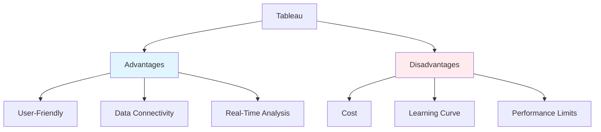
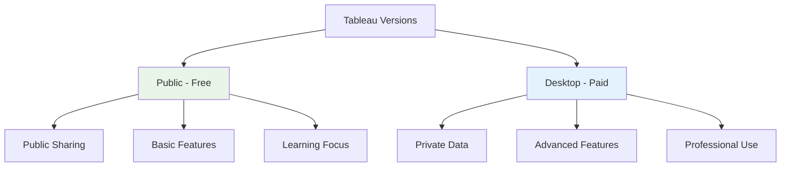
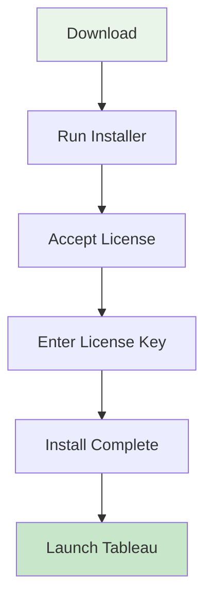
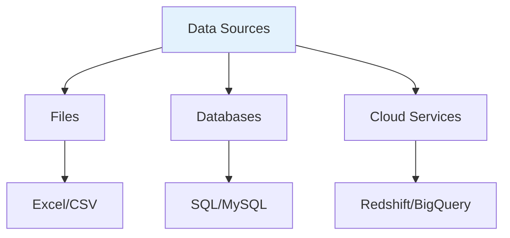
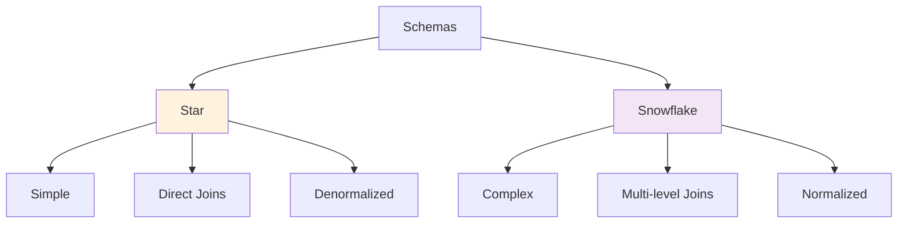
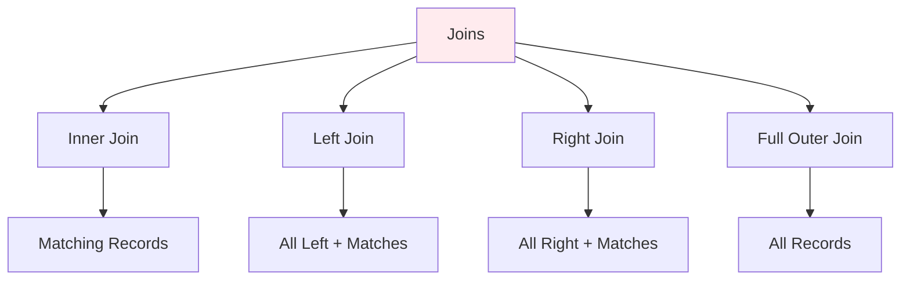
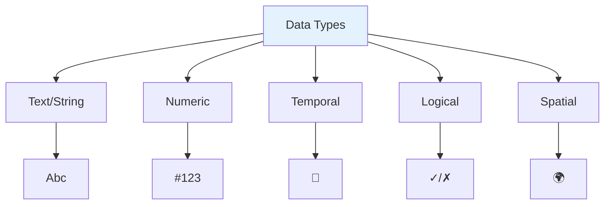

# 📊 Tableau Learning Notes

Welcome to your personal Tableau learning repository! This README contains structured notes on key topics. Expand sections below for details.

## Table of Contents
- [Overview](#overview)
- [Notes](#notes)
  - [Advantages and Disadvantages](#advantages-and-disadvantages)
  - [Tableau Public and Desktop](#tableau-public-and-desktop)
  - [Desktop Installation](#desktop-installation)
  - [Connecting Tableau to Data Sources](#connecting-tableau-to-data-sources)

## Overview
Tableau is a powerful data visualization and business intelligence (BI) software tool that allows users to connect to various data sources, create interactive dashboards, and generate insightful reports without requiring extensive coding skills. It is widely used for data analysis, exploration, and sharing visualizations to support decision-making in organizations.

🔗 [Official Tableau Website](https://www.tableau.com/)

## Notes

### 🚀 Advantages and Disadvantages
[📖 Read full notes](advantages-and-disadvantages.md)

**Key Comparison:**

### 🆓 Tableau Public and Desktop
[📖 Read full notes](tableau-public-and-desktop.md)

**Version Comparison:**

### 💻 Desktop Installation
[📖 Read full notes](desktop-installation.md)

**Installation Flow:**

### 🔗 Connecting Tableau to Data Sources
[📖 Read full notes](connecting-tableau-to-data-sources.md)

**Data Source Types:**

### 📊 Data Models: Star Schema and Snowflake
[📖 Read full notes](data-models-star-snowflake.md)

**Schema Comparison:**

### 🔗 Joins in Data Models
[📖 Read full notes](joins-in-data-models.md)

**Join Types:**

### 📊 Data Types in Tableau
[📖 Read full notes](data-types-in-tableau.md)

**Data Type Categories:**

---

💡 **Tip**: Provide more topics to expand this guide! Contributions welcome.