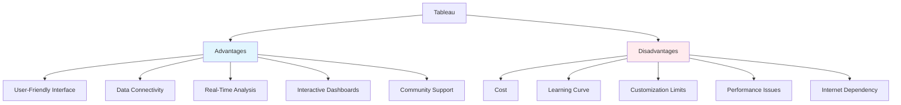

# 🚀 Advantages and Disadvantages

## Advantages

- **User-Friendly Interface**: Drag-and-drop functionality makes it accessible for non-technical users.
- **Data Connectivity**: Supports a wide range of data sources, including databases, spreadsheets, and cloud services.
- **Real-Time Analysis**: Enables live data updates and interactive visualizations.
- **Interactive Dashboards**: Allows creation of dynamic, shareable dashboards for better insights.
- **Community Support**: Large user community and extensive resources for learning and troubleshooting.

## Disadvantages

- **Cost**: Licensing can be expensive, especially for enterprise versions.
- **Learning Curve**: Advanced features may require time to master.
- **Customization Limits**: Less flexible than coding-based tools like Python or R for highly customized visualizations.
- **Performance**: Can slow down with very large datasets without optimization.
- **Dependency on Internet**: Some features, like Tableau Online, require internet connectivity.

## Visual Comparison

## Advantages vs Disadvantages Matrix

| Aspect | Advantages | Disadvantages |
|--------|------------|---------------|
| **Ease of Use** | ✅ Drag-and-drop interface | ❌ Steep learning curve for advanced features |
| **Cost** | ❌ Expensive licensing | ✅ Free version available (Tableau Public) |
| **Customization** | ❌ Limited compared to coding tools | ✅ Rich visualization options |
| **Performance** | ❌ Can slow with large datasets | ✅ Optimized for BI workloads |
| **Connectivity** | ✅ Wide range of data sources | ❌ Some features require internet |
| **Community** | ✅ Large user community | ❌ Commercial support can be costly |