# 📊 Charts in Tableau

## Overview

Tableau offers a wide variety of chart types to visualize data effectively. The choice of chart depends on the data type, the story you want to tell, and the insights you want to highlight.

## Show Me Panel

The **Show Me** panel in Tableau automatically suggests appropriate chart types based on your selected fields:

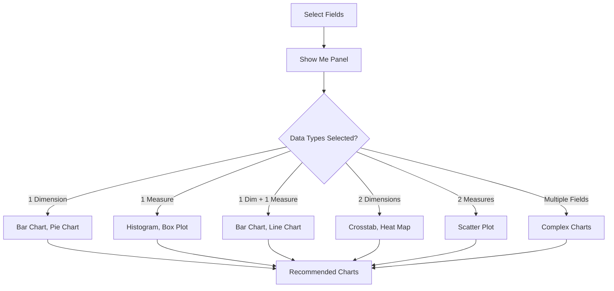

## Basic Charts

### 1. Bar Chart
**Best for**: Comparing categories, showing frequency distributions

**When to use**:
- Compare values across categories
- Show ranking or ordering
- Display frequency counts

**How to create**:
1. Drag Dimension to Columns
2. Drag Measure to Rows
3. Select Bar Chart from Show Me

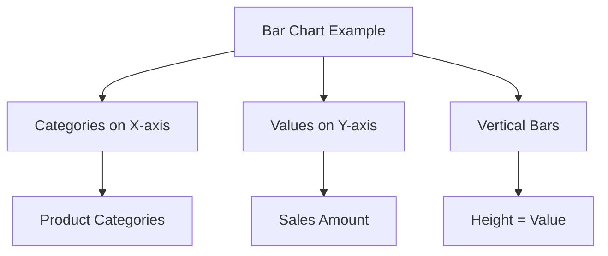

### 2. Line Chart
**Best for**: Showing trends over time, continuous data

**When to use**:
- Time series analysis
- Trend identification
- Continuous data patterns

**How to create**:
1. Drag Date Dimension to Columns
2. Drag Measure to Rows
3. Select Line Chart from Show Me

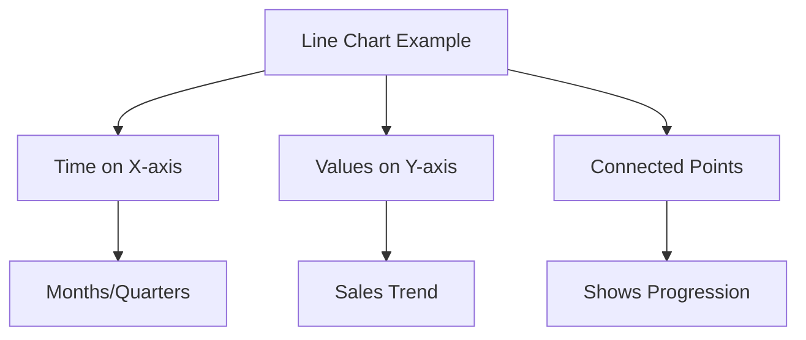

### 3. Pie Chart
**Best for**: Showing parts of a whole, percentage distributions

**When to use**:
- Market share analysis
- Budget allocation
- Simple part-to-whole relationships

**How to create**:
1. Drag Dimension to Color
2. Drag Measure to Angle
3. Select Pie Chart from Show Me

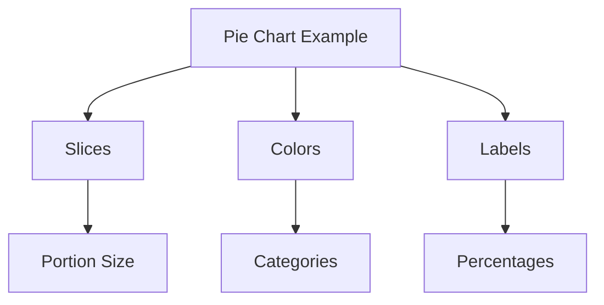

## Advanced Charts

### 4. Scatter Plot
**Best for**: Correlation analysis, relationship identification

**When to use**:
- Find correlations between variables
- Identify outliers
- Show distribution patterns

**How to create**:
1. Drag Measure to Columns (X-axis)
2. Drag Measure to Rows (Y-axis)
3. Drag Dimension to Color/Shape (optional)

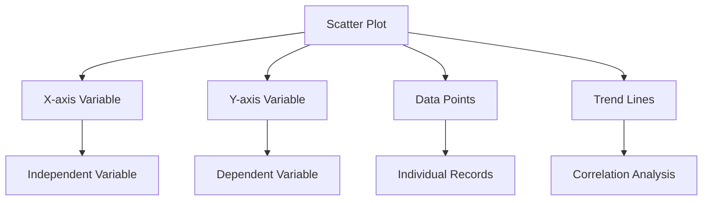

### 5. Histogram
**Best for**: Distribution analysis, frequency patterns

**When to use**:
- Understand data distribution
- Identify skewness
- Find normal distribution patterns

**How to create**:
1. Drag Measure to Columns
2. Right-click > Create > Bins
3. Drag Bins to Columns, Measure to Rows

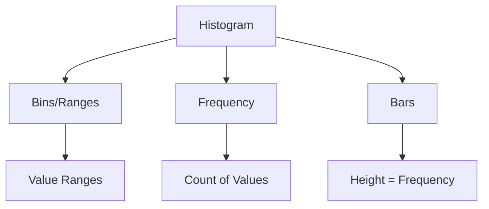

### 6. Box Plot (Box and Whisker)
**Best for**: Statistical distribution, outlier detection

**When to use**:
- Compare distributions across categories
- Identify outliers and variability
- Show quartiles and medians

**How to create**:
1. Drag Dimension to Columns
2. Drag Measure to Rows
3. Select Box Plot from Show Me

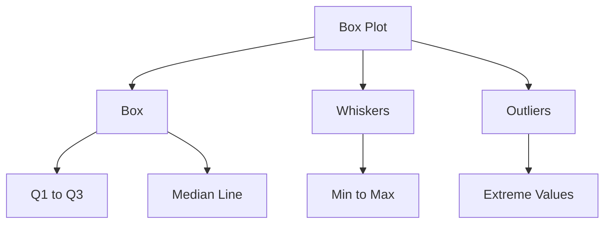

## Specialized Charts

### 7. Maps
**Best for**: Geographic data, location-based analysis

**Types**:
- **Symbol Maps**: Points on map
- **Filled Maps**: Choropleth maps
- **Density Maps**: Heat maps

**When to use**:
- Geographic analysis
- Regional comparisons
- Location-based trends

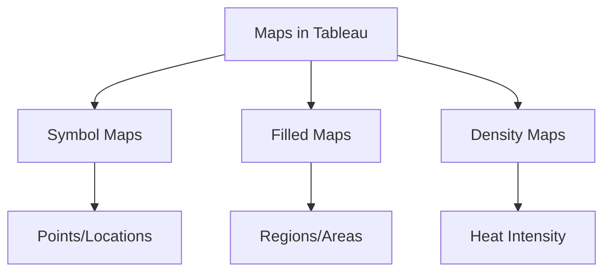

### 8. Tree Map
**Best for**: Hierarchical data, part-to-whole relationships

**When to use**:
- Show hierarchical structure
- Compare proportions
- Display nested categories

**How to create**:
1. Drag Dimensions to Color/Size
2. Drag Measure to Size
3. Select Tree Map from Show Me

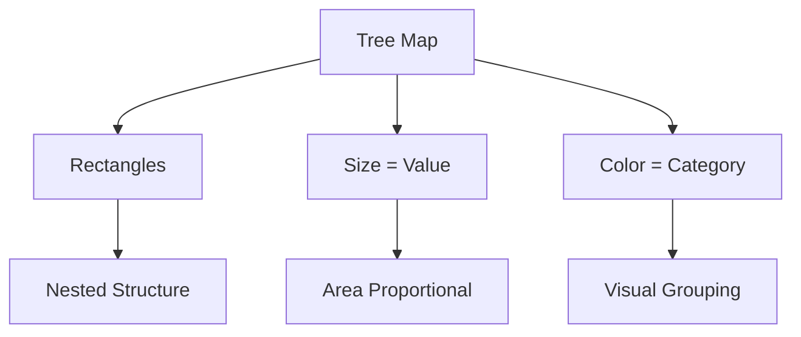

### 9. Heat Map
**Best for**: Matrix data, correlation matrices

**When to use**:
- Show relationships between two dimensions
- Color-coded value intensity
- Matrix comparisons

**How to create**:
1. Drag Dimensions to Rows and Columns
2. Drag Measure to Color
3. Select Heat Map from Show Me

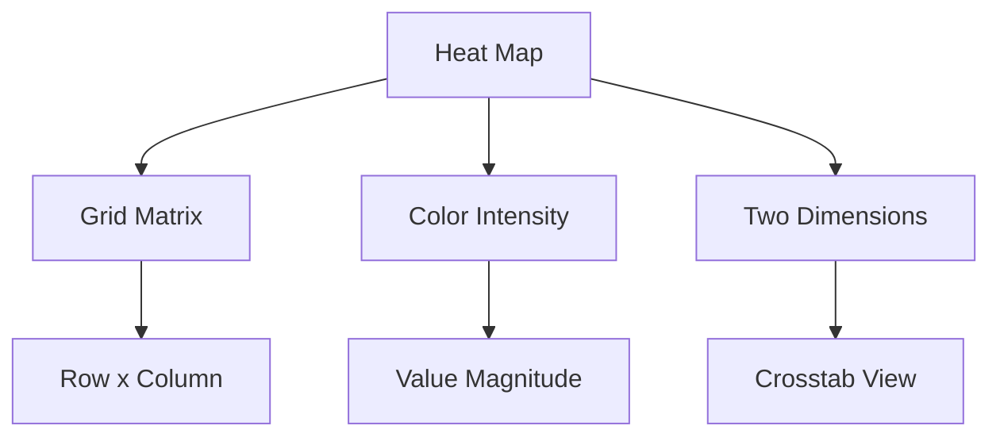

### 10. Bullet Chart
**Best for**: Performance against targets, KPIs

**When to use**:
- Compare actual vs target values
- Show performance indicators
- Dashboard KPIs

**How to create**:
1. Drag Measure to Columns (actual)
2. Drag Measure to Columns (target)
3. Select Bullet Chart from Show Me

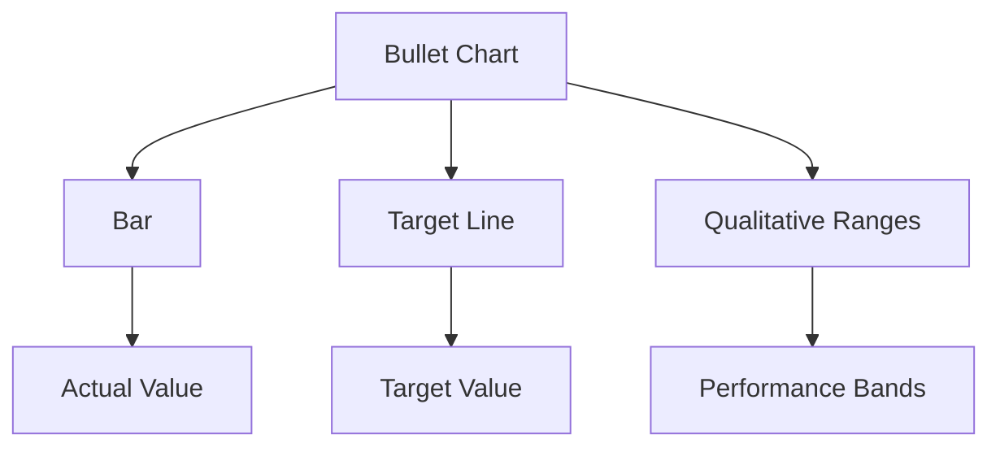

## Chart Selection Guide

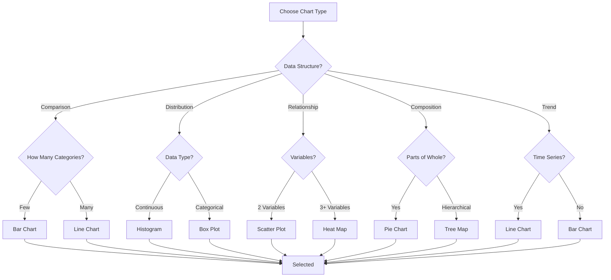

## Advanced Chart Techniques

### Dual Axis Charts
**Purpose**: Compare two different measures with different scales

**How to create**:
1. Create first chart
2. Drag second measure to opposite axis
3. Right-click > Dual Axis

### Reference Lines
**Purpose**: Add context with averages, totals, or targets

**How to create**:
1. Right-click axis > Add Reference Line
2. Choose type (average, median, total, etc.)

### Trend Lines
**Purpose**: Show data patterns and predictions

**How to create**:
1. Right-click data points > Trend Lines > Show Trend Lines
2. Choose model type (linear, logarithmic, etc.)

## Best Practices

### Chart Design
- **Keep it Simple**: Avoid chart junk
- **Use Appropriate Colors**: Color should add meaning
- **Clear Labels**: Ensure axes and legends are readable
- **Consistent Scaling**: Use consistent scales for comparisons

### Data Considerations
- **Data Volume**: Some charts don't work well with too much data
- **Data Types**: Choose charts that match your data types
- **Null Values**: Handle missing data appropriately

### Performance
- **Extracts**: Use for large datasets
- **Filters**: Apply filters to reduce data volume
- **Calculations**: Minimize complex calculations

## Common Chart Issues

### 1. Overplotting
**Problem**: Too many data points overlap
**Solution**: Use sampling, aggregation, or different chart types

### 2. Color Confusion
**Problem**: Poor color choices make charts hard to read
**Solution**: Use colorblind-friendly palettes, limit colors

### 3. Scale Issues
**Problem**: Inappropriate scales distort perception
**Solution**: Use logarithmic scales or normalize data

### 4. Too Much Data
**Problem**: Charts become cluttered with too many categories
**Solution**: Group data, use top N filters, or drill-down techniques

## Chart Types by Data Type

| Data Type | Recommended Charts |
|-----------|-------------------|
| **Categorical** | Bar, Pie, Tree Map |
| **Time Series** | Line, Area, Bar |
| **Numerical** | Histogram, Box Plot, Scatter |
| **Geographic** | Maps, Filled Maps |
| **Hierarchical** | Tree Map, Sunburst |
| **Correlation** | Scatter Plot, Heat Map |

## Dashboard Integration

### Chart Placement
- **Top**: Key metrics and KPIs
- **Middle**: Detailed analysis charts
- **Bottom**: Supporting data and filters

### Interactivity
- **Filters**: Connect charts with filters
- **Parameters**: Add dynamic controls
- **Actions**: Enable chart-to-chart interactions

### Layout Best Practices
- **White Space**: Use appropriate spacing
- **Alignment**: Align charts consistently
- **Hierarchy**: Guide attention with size and position

🔗 [Tableau Chart Types Documentation](https://help.tableau.com/current/pro/desktop/en-us/buildmanual.htm)
🔗 [Chart Selection Guide](https://www.tableau.com/learn/articles/chart-types)