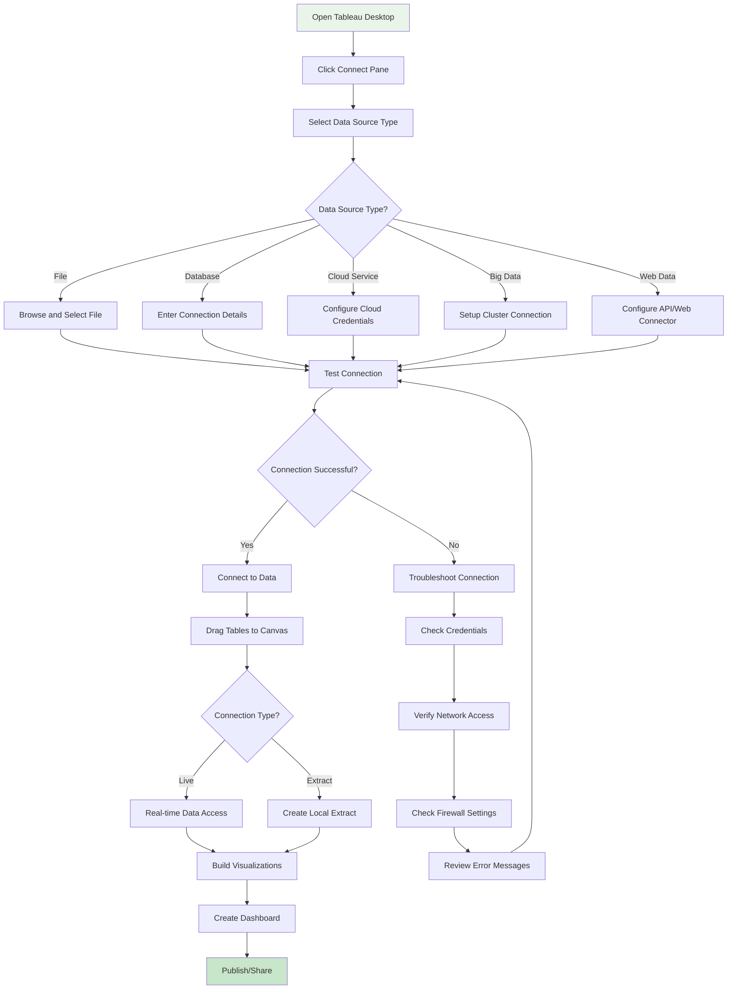
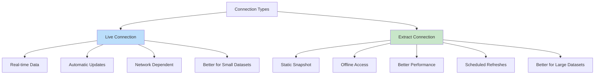

# 🔗 Connecting Tableau to Data Sources

Tableau can connect to a wide variety of data sources, including files, databases, and cloud services. Below are the steps and supported sources.

### Supported Data Sources
- **Files**: Excel, CSV, JSON, PDF, etc.
- **Databases**: SQL Server, MySQL, PostgreSQL, Oracle, etc.
- **Cloud Services**: Amazon Redshift, Google BigQuery, Snowflake, etc.
- **Big Data**: Hadoop, Spark, etc.
- **Web Data**: Web data connectors for APIs.

### Steps to Connect
1. Open Tableau Desktop and click on the **Connect** pane on the left.
2. Select the data source type (e.g., "Microsoft Excel" or "MySQL").
3. Enter connection details:
   - For files: Browse and select the file.
   - For databases: Provide server name, database name, username, and password.
4. Test the connection and click **Connect**.
5. Drag tables to the canvas or write custom SQL queries.
6. Once connected, you can start building visualizations.

### Tips
- Use **Live** connection for real-time data or **Extract** for performance with large datasets.
- Ensure proper permissions and network access for remote sources.
- For Tableau Public, only public data sources are allowed.

🔗 [Tableau Data Connectors](https://www.tableau.com/products/techspecs)

## Data Source Categories

```mermaid
graph TD
    A[Data Sources] --> B[Files]
    A --> C[Databases]
    A --> D[Cloud Services]
    A --> E[Big Data]
    A --> F[Web Data]
    
    B --> G[Excel]
    B --> H[CSV]
    B --> I[JSON]
    B --> J[PDF]
    B --> K[Text Files]
    
    C --> L[SQL Server]
    C --> M[MySQL]
    C --> N[PostgreSQL]
    C --> O[Oracle]
    C --> P[Access]
    
    D --> Q[Amazon Redshift]
    D --> R[Google BigQuery]
    D --> S[Snowflake]
    D --> T[Azure SQL]
    D --> U[AWS RDS]
    
    E --> V[Hadoop]
    E --> W[Spark]
    E --> X[Cloudera]
    E --> Y[MapR]
    
    F --> Z[Web Data Connectors]
    F --> AA[APIs]
    F --> BB[REST Services]
    
    style A fill:#e3f2fd
    style B fill:#f3e5f5
    style C fill:#fff3e0
    style D fill:#e8f5e8
    style E fill:#ffebee
    style F fill:#fce4ec
```

## Connection Process Flowchart

## Connection Types Comparison

## Data Source Compatibility Matrix

| Data Source Type | Tableau Public | Tableau Desktop | Live Connection | Extract Support |
|------------------|----------------|-----------------|----------------|-----------------|
| **Excel/CSV** | ✅ | ✅ | ✅ | ✅ |
| **SQL Server** | ❌ | ✅ | ✅ | ✅ |
| **MySQL** | ❌ | ✅ | ✅ | ✅ |
| **PostgreSQL** | ❌ | ✅ | ✅ | ✅ |
| **Oracle** | ❌ | ✅ | ✅ | ✅ |
| **Amazon Redshift** | ❌ | ✅ | ✅ | ✅ |
| **Google BigQuery** | ❌ | ✅ | ✅ | ✅ |
| **Snowflake** | ❌ | ✅ | ✅ | ✅ |
| **Hadoop** | ❌ | ✅ | ✅ | ✅ |
| **Web APIs** | ✅ | ✅ | ❌ | ✅ |

*Note: Tableau Public only supports public data sources and web data connectors*