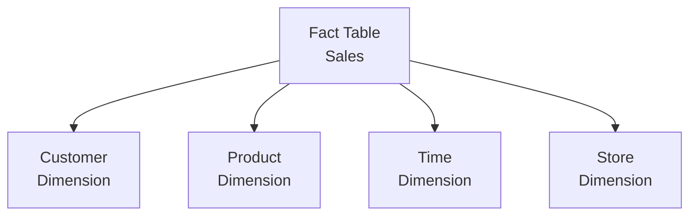
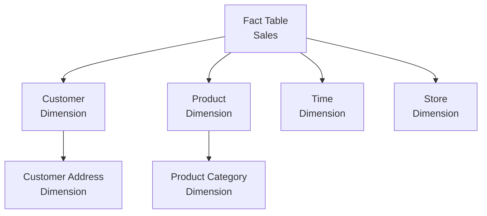

# 📊 Data Models: Star Schema and Snowflake

## Star Schema

A star schema is a type of database schema commonly used in data warehousing and business intelligence. It gets its name from the star-like structure where a central fact table is connected to multiple dimension tables.

### Key Components
- **Fact Table**: Contains quantitative data (measures) and foreign keys to dimension tables. Examples: sales amount, quantity, profit.
- **Dimension Tables**: Contain descriptive attributes that provide context to the facts. Examples: customer details, product information, time periods.

### Structure
```
Fact Table (Sales)
├── Customer ID → Customer Dimension
├── Product ID → Product Dimension
├── Time ID → Time Dimension
├── Store ID → Store Dimension
└── Measures: Sales Amount, Quantity, etc.
```



### Advantages
- Simple and intuitive structure
- Fast query performance due to fewer joins
- Easy to understand and maintain
- Optimized for read-heavy operations (OLAP)

### Disadvantages
- Data redundancy in dimension tables
- Can lead to larger storage requirements
- Less normalized than other schemas

## Snowflake Schema

A snowflake schema is an extension of the star schema where dimension tables are normalized into multiple related tables. This creates a more complex structure that resembles a snowflake.

### Key Components
- **Fact Table**: Same as star schema
- **Dimension Tables**: Normalized, split into multiple related tables to reduce redundancy

### Structure
```
Fact Table (Sales)
├── Customer ID → Customer Dimension
│   ├── Customer Details
│   └── Customer Address → Address Dimension
├── Product ID → Product Dimension
│   ├── Product Details
│   └── Product Category → Category Dimension
├── Time ID → Time Dimension
└── Measures: Sales Amount, Quantity, etc.
```



### Advantages
- Reduces data redundancy
- More normalized structure
- Better data integrity
- Smaller storage footprint

### Disadvantages
- More complex queries due to additional joins
- Slower query performance
- Harder to understand and maintain
- Not as optimized for OLAP operations

## Star vs Snowflake Schema

| Aspect | Star Schema | Snowflake Schema |
|--------|-------------|------------------|
| **Normalization** | Denormalized | Normalized |
| **Joins** | Fewer joins | More joins |
| **Query Performance** | Faster | Slower |
| **Storage** | More storage | Less storage |
| **Complexity** | Simple | Complex |
| **Maintenance** | Easier | Harder |

## When to Use Each Schema

### Use Star Schema When:
- Query performance is critical
- You have a simple data structure
- Most users are business analysts who need fast reports
- Storage space is not a major concern

### Use Snowflake Schema When:
- Data integrity is paramount
- You need to minimize redundancy
- Storage optimization is important
- You have complex hierarchical data

## Tableau and Schema Considerations

Tableau works well with both star and snowflake schemas. When connecting to data sources:

- **Star Schema**: Tableau can easily create relationships and perform aggregations
- **Snowflake Schema**: May require careful join configuration in Tableau's data source editor
- **Best Practice**: If using snowflake, consider creating a view in your database to flatten the structure for Tableau

### Tips for Tableau Users
- Use Tableau's Data Source tab to visualize and optimize your schema connections
- Consider using extracts for better performance with complex schemas
- Leverage Tableau's relationship model (from version 2020.2+) for flexible data modeling

🔗 [Tableau Data Modeling Best Practices](https://help.tableau.com/current/pro/desktop/en-us/datasource_prepare.htm)