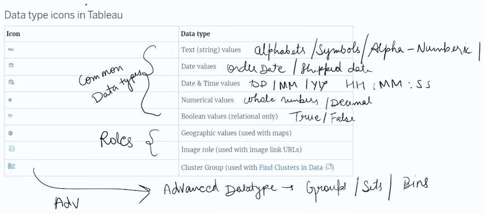
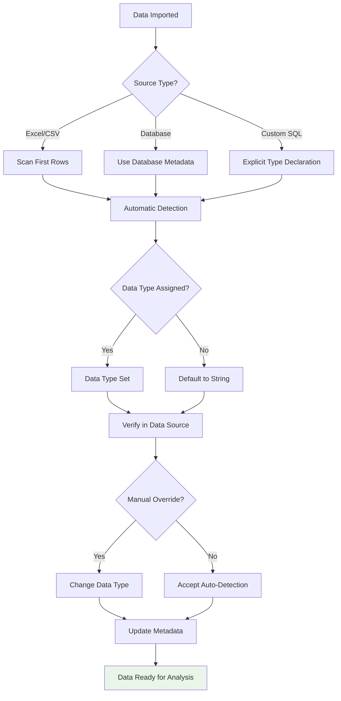
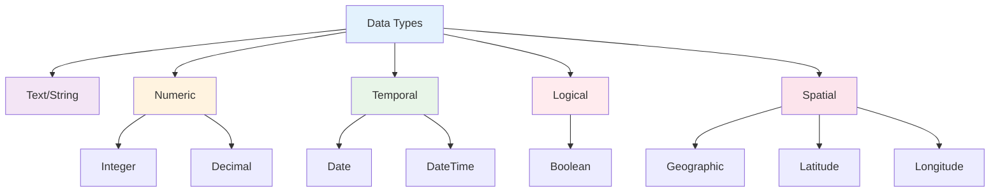
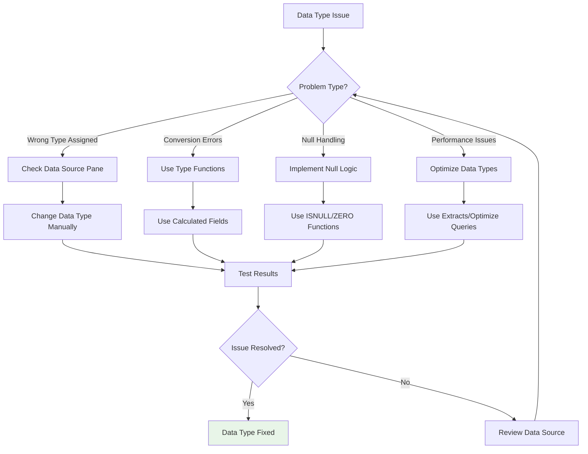

# 📊 Data Types in Tableau

## Overview

Data types in Tableau determine how data is interpreted, displayed, and can be used in calculations and visualizations. Understanding data types is crucial for effective data analysis and avoiding common pitfalls.


## Tableau Data Types

### 1. String (Text)
- **Description**: Text or character data
- **Examples**: Names, addresses, categories
- **Icon**: Abc
- **Operations**: Concatenation, substring, case conversion

### 2. Number (Numeric)
- **Description**: Whole numbers and decimal values
- **Subtypes**:
  - **Integer**: Whole numbers (-2,147,483,648 to 2,147,483,647)
  - **Float/Double**: Decimal numbers with high precision
- **Icon**: #123
- **Operations**: Mathematical calculations, aggregations

### 3. Date
- **Description**: Date values without time
- **Format**: YYYY-MM-DD
- **Icon**: 📅
- **Operations**: Date arithmetic, date parts extraction

### 4. Date & Time
- **Description**: Combined date and time values
- **Format**: YYYY-MM-DD HH:MM:SS
- **Icon**: 📅🕐
- **Operations**: Time-based calculations, duration analysis

### 5. Boolean (True/False)
- **Description**: Logical values
- **Values**: True, False, NULL
- **Icon**: ✓/✗
- **Operations**: Logical expressions, filtering

### 6. Geographic (Spatial)
- **Description**: Location-based data
- **Types**: Latitude/Longitude, country names, postal codes
- **Icon**: 🌍
- **Operations**: Mapping, spatial analysis

## Data Type Detection Flowchart



## Data Type Conversion

### Automatic Conversion
Tableau automatically converts data types based on content:
- Numbers stored as text → Numeric
- Dates in text format → Date/DateTime
- "True"/"False" → Boolean

### Manual Conversion
Using the data source pane or calculated fields:

```sql
-- String to Number
INT([Text Field])

-- Number to String
STR([Number Field])

-- String to Date
DATE([Date String])

-- Date to String
STR([Date Field])
```

## Data Type Hierarchy



## Data Type Compatibility Matrix

| Operation | String | Number | Date | DateTime | Boolean | Geographic |
|-----------|--------|--------|------|----------|---------|------------|
| **Aggregation** | ❌ | ✅ | ❌ | ❌ | ❌ | ❌ |
| **Math Operations** | ❌ | ✅ | ✅ | ✅ | ❌ | ❌ |
| **String Functions** | ✅ | ❌ | ❌ | ❌ | ❌ | ✅ |
| **Date Functions** | ❌ | ❌ | ✅ | ✅ | ❌ | ❌ |
| **Logical Operations** | ❌ | ❌ | ❌ | ❌ | ✅ | ❌ |
| **Mapping** | ❌ | ❌ | ❌ | ❌ | ❌ | ✅ |
| **Sorting** | ✅ | ✅ | ✅ | ✅ | ✅ | ✅ |
| **Grouping** | ✅ | ✅ | ✅ | ✅ | ✅ | ✅ |

## Common Data Type Issues

### 1. Mixed Data Types
**Problem**: Column contains both numbers and text
**Solution**: Clean data at source or use calculated fields

### 2. Date Format Issues
**Problem**: Dates not recognized due to inconsistent formatting
**Solution**: Standardize date formats or use DATEPARSE()

### 3. Null Values
**Problem**: Missing data affects calculations
**Solution**: Use ISNULL() or ZN() functions

### 4. Precision Loss
**Problem**: Large numbers lose precision
**Solution**: Store as strings for display, convert for calculations

## Data Type Best Practices

### Data Preparation
- **Clean Data at Source**: Fix data types before importing
- **Consistent Formatting**: Use standard date/number formats
- **Handle Nulls**: Decide on null handling strategy

### Tableau Configuration
- **Verify Auto-Detection**: Check data types in data source pane
- **Use Appropriate Types**: Choose most restrictive type that works
- **Create Parameters**: Use parameters for type conversion

### Performance Optimization
- **Avoid Unnecessary Conversions**: Convert data types once, not repeatedly
- **Use Extracts**: Extracts can optimize data types
- **Index Appropriately**: Consider data types for database indexing

## Data Type Conversion Functions

### String Functions
```sql
-- Length
LEN([String Field])

-- Substring
LEFT([String], 3)
RIGHT([String], 3)
MID([String], 2, 5)

-- Case conversion
UPPER([String])
LOWER([String])
```

### Numeric Functions
```sql
-- Rounding
ROUND([Number], 2)

-- Absolute value
ABS([Number])

-- Square root
SQRT([Number])
```

### Date Functions
```sql
-- Current date
TODAY()
NOW()

-- Date parts
YEAR([Date])
MONTH([Date])
DAY([Date])

-- Date arithmetic
DATEADD('month', 1, [Date])
DATEDIFF('day', [Start Date], [End Date])
```

### Type Conversion Functions
```sql
-- To String
STR([Field])

-- To Number
INT([String])
FLOAT([String])

-- To Date
DATE([String])
DATEPARSE('format', [String])

-- To Boolean
[Field] = 'Yes'  -- Creates boolean
```

## Data Type Troubleshooting Guide



## Advanced Data Type Concepts

### Custom Number Formats
- **Currency**: Format as currency with symbols
- **Percentage**: Display as percentages
- **Scientific**: Scientific notation for large numbers

### Geographic Data Types
- **Auto-Geocoding**: Tableau recognizes location names
- **Custom Geocoding**: Import custom geographic data
- **Spatial Files**: Support for Shapefiles, GeoJSON

### Calculated Field Types
- **Dimensions**: Categorical data for grouping
- **Measures**: Numeric data for aggregation
- **Parameters**: Dynamic values for interactivity

## Data Type Impact on Visualizations

| Data Type | Chart Types | Best Practices |
|-----------|-------------|----------------|
| **String** | Bar charts, treemaps | Use for categories, limit unique values |
| **Number** | Line charts, scatter plots | Ensure proper aggregation |
| **Date** | Time series, Gantt charts | Use continuous for trends |
| **Boolean** | Pie charts, indicators | Use for binary classifications |
| **Geographic** | Maps, density plots | Ensure accurate location data |

🔗 [Tableau Data Types Documentation](https://help.tableau.com/current/pro/desktop/en-us/datafields_typesandroles_datatypes.htm)
🔗 [Data Preparation Best Practices](https://help.tableau.com/current/pro/desktop/en-us/data-prep.htm)