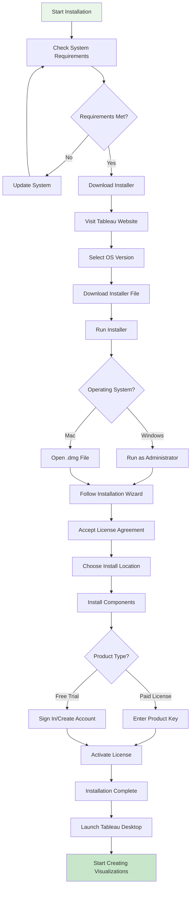
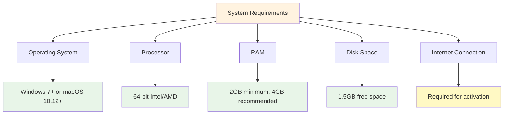
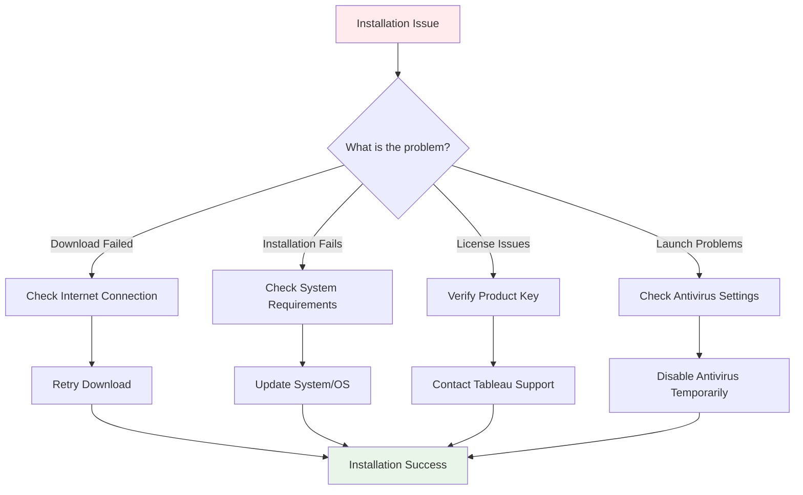

# 💻 Desktop Installation

### System Requirements
- **Operating System**: Windows 7 or later, macOS 10.12 or later.
- **Processor**: Intel or AMD 64-bit processor.
- **RAM**: At least 2 GB (4 GB recommended).
- **Disk Space**: 1.5 GB free space.
- **Internet**: Required for activation and updates.

### Installation Steps
1. Visit the [Tableau Downloads Page](https://www.tableau.com/products/desktop/download).
2. Select your operating system (Windows or Mac) and download the installer.
3. Run the downloaded file as an administrator (Windows) or open the .dmg file (Mac).
4. Follow the on-screen instructions to install.
5. Enter your product key if you have a paid license, or sign in with your Tableau account.
6. Launch Tableau Desktop and start creating visualizations!

### Troubleshooting
- Ensure your system meets the requirements.
- Disable antivirus temporarily if installation fails.
- Contact Tableau Support for license issues.

## Installation Process Flowchart

## System Requirements Check

## Troubleshooting Decision Tree

