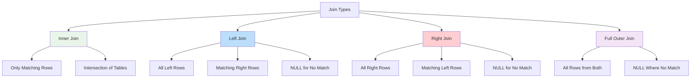
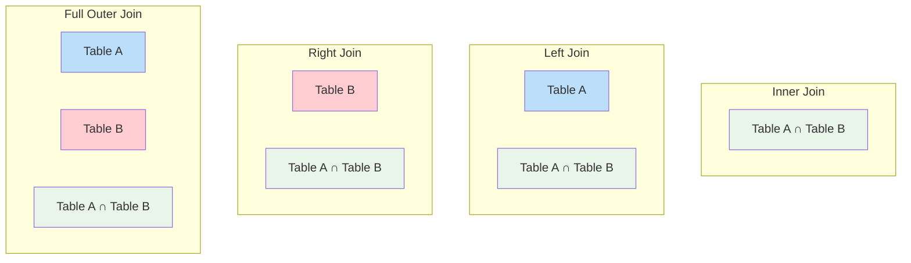
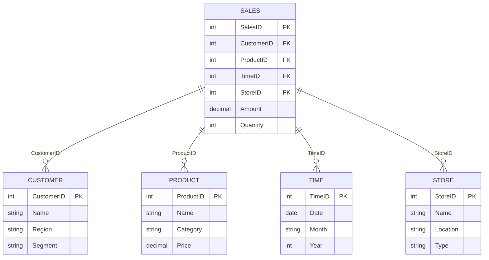
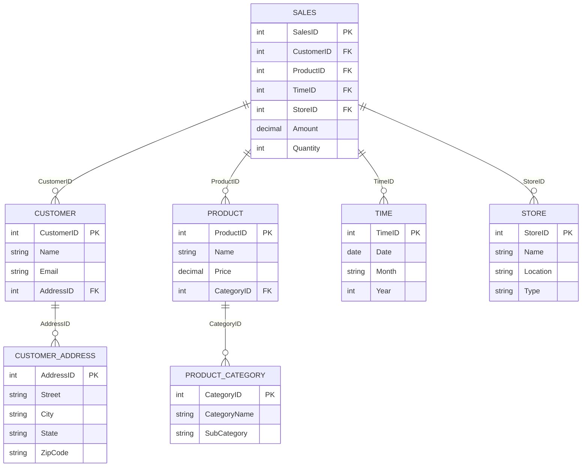
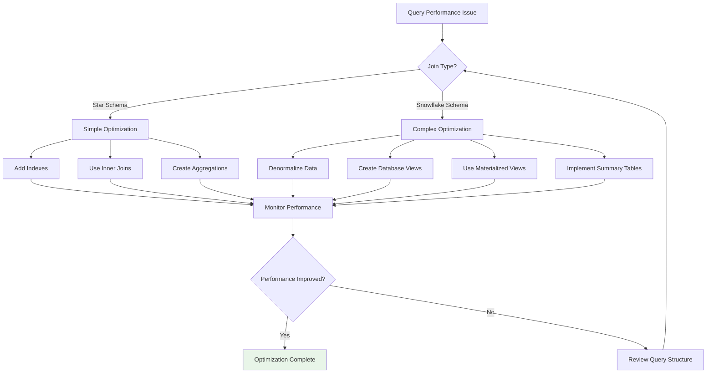
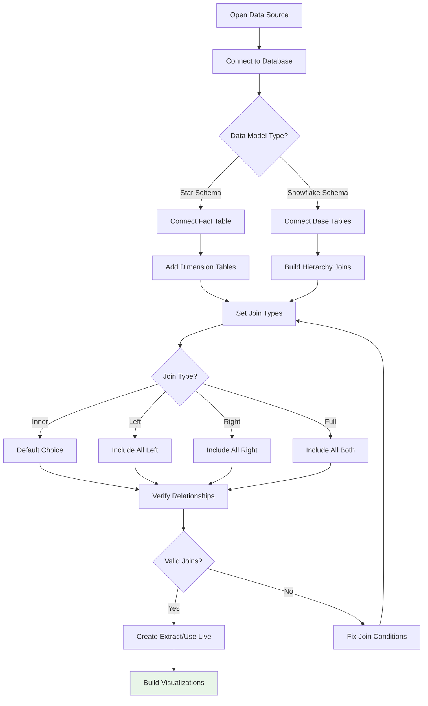
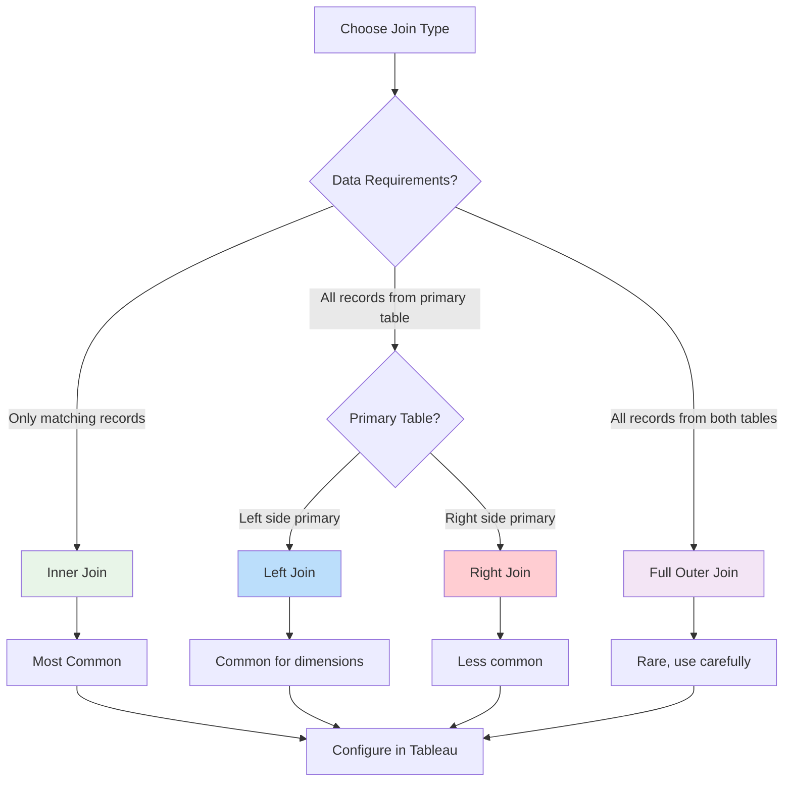
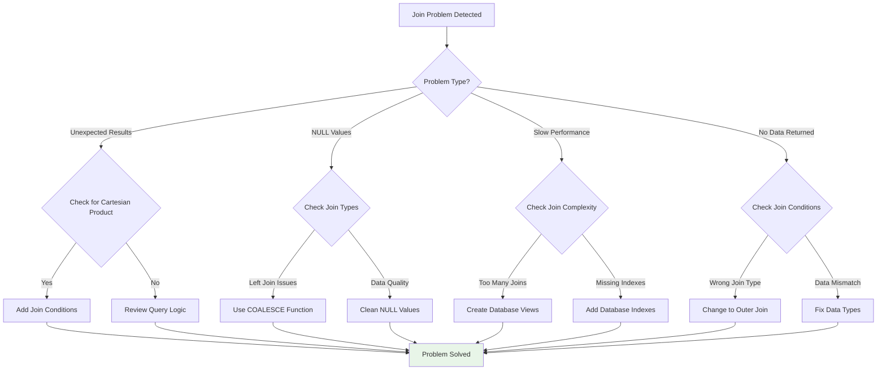
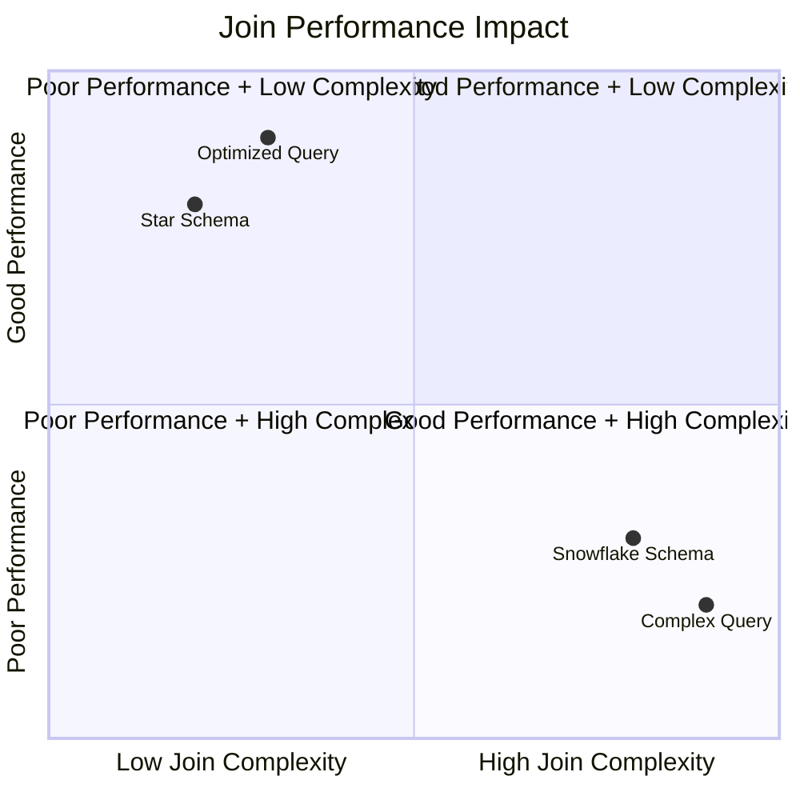
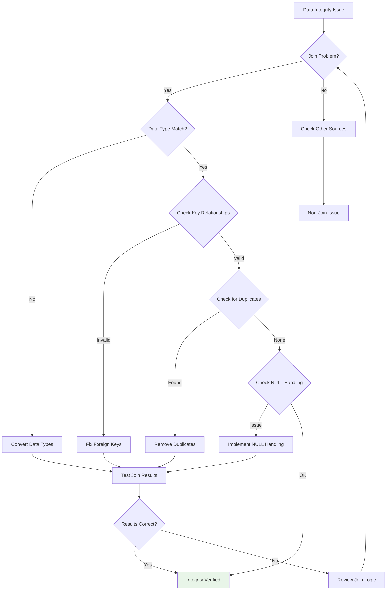

# 🔗 Joins in Data Models

## Overview

Joins are fundamental operations in relational databases that combine data from multiple tables based on related columns. In data warehousing and business intelligence, understanding joins is crucial for working with star and snowflake schemas effectively.

## Types of Joins

### Inner Join
Returns only the rows where there is a match in both tables.

```sql
SELECT * FROM fact_table f
INNER JOIN dimension_table d ON f.dimension_id = d.id
```

### Left Join (Left Outer Join)
Returns all rows from the left table and matching rows from the right table. Non-matching rows from the right table show as NULL.

```sql
SELECT * FROM fact_table f
LEFT JOIN dimension_table d ON f.dimension_id = d.id
```

### Right Join (Right Outer Join)
Returns all rows from the right table and matching rows from the left table.

```sql
SELECT * FROM fact_table f
RIGHT JOIN dimension_table d ON f.dimension_id = d.id
```

### Full Outer Join
Returns all rows from both tables, with NULL values where there is no match.

```sql
SELECT * FROM fact_table f
FULL OUTER JOIN dimension_table d ON f.dimension_id = d.id
```

## Join Types Visual Guide



## Join Venn Diagram Representation



## Joins in Star Schema

In a star schema, joins are straightforward since the fact table connects directly to each dimension table using foreign keys. This results in simple, fast joins.



**Join Example in Star Schema:**
```sql
SELECT
    s.Amount,
    c.Name as CustomerName,
    p.Name as ProductName,
    t.Month,
    st.Name as StoreName
FROM SALES s
INNER JOIN CUSTOMER c ON s.CustomerID = c.CustomerID
INNER JOIN PRODUCT p ON s.ProductID = p.ProductID
INNER JOIN TIME t ON s.TimeID = t.TimeID
INNER JOIN STORE st ON s.StoreID = st.StoreID
```

## Joins in Snowflake Schema

Snowflake schemas require more complex joins due to the normalized structure. Dimension tables are split into multiple levels, requiring multiple joins to access all attributes.



**Join Example in Snowflake Schema:**
```sql
SELECT
    s.Amount,
    c.Name as CustomerName,
    ca.City,
    p.Name as ProductName,
    pc.CategoryName,
    t.Month,
    st.Name as StoreName
FROM SALES s
INNER JOIN CUSTOMER c ON s.CustomerID = c.CustomerID
INNER JOIN CUSTOMER_ADDRESS ca ON c.AddressID = ca.AddressID
INNER JOIN PRODUCT p ON s.ProductID = p.ProductID
INNER JOIN PRODUCT_CATEGORY pc ON p.CategoryID = pc.CategoryID
INNER JOIN TIME t ON s.TimeID = t.TimeID
INNER JOIN STORE st ON s.StoreID = st.StoreID
```

## Join Performance Considerations

| Schema Type | Join Complexity | Performance Impact | Typical Use Case |
|-------------|----------------|-------------------|------------------|
| **Star Schema** | Simple (1 level) | Fast queries, fewer joins | Operational reporting, simple analytics |
| **Snowflake Schema** | Complex (multi-level) | Slower queries, more joins | Complex analytics, detailed reporting |

### Performance Optimization Tips
- **Indexing**: Ensure foreign key columns are indexed
- **Query Optimization**: Use appropriate join types to minimize data scanning
- **Materialized Views**: Pre-compute complex joins for frequently used queries
- **Database Views**: Create views to simplify complex join patterns

## Performance Comparison Chart

```mermaid
bar-beta
    title Join Performance Comparison
    x-axis [Star Schema, Snowflake Schema]
    y-axis Performance (higher is better)
    bar [95, 70]
    bar [90, 60]
    bar [85, 50]
```

## Optimization Strategy Flowchart



## Tableau Join Configuration

When setting up joins in Tableau's Data Source editor:

### For Star Schema:
1. Connect to fact table first
2. Add dimension tables with inner/left joins
3. Use foreign key relationships
4. Verify join conditions in the Data Source canvas

### For Snowflake Schema:
1. Start with the most detailed dimension tables
2. Work upwards through the hierarchy
3. Consider creating custom SQL or database views to simplify
4. Use Tableau's join canvas to visualize complex relationships

### Join Types in Tableau:
- **Inner Join**: Only matching records (default for most cases)
- **Left Join**: All records from left table, matching from right
- **Right Join**: All records from right table, matching from left
- **Full Outer Join**: All records from both tables

### Best Practices in Tableau:
- **Data Extracts**: Use extracts for better performance with complex joins
- **Relationship Model**: Leverage Tableau's relationship model (v2020.2+) for flexible data modeling
- **Custom SQL**: Use custom SQL when joins become too complex for the visual interface
- **Performance Testing**: Test query performance with different join configurations

## Tableau Join Setup Workflow



## Join Type Decision Tree



## Common Join Issues and Solutions

### 1. Cartesian Products
**Problem**: Missing join conditions lead to unintended cross-joins
**Solution**: Always specify join conditions explicitly

### 2. Null Values in Joins
**Problem**: Left joins can introduce NULL values that affect calculations
**Solution**: Use COALESCE or ISNULL functions to handle NULLs

### 3. Performance Degradation
**Problem**: Too many joins slow down queries
**Solution**: Denormalize data or use summary tables for aggregations

### 4. Data Type Mismatches
**Problem**: Joining on incompatible data types
**Solution**: Ensure consistent data types for join keys

## Join Issues Troubleshooting Guide



## Join Performance Impact Matrix



## Data Integrity Check Flow



🔗 [Tableau Joins Documentation](https://help.tableau.com/current/pro/desktop/en-us/joining_tables.htm)
🔗 [SQL Join Best Practices](https://www.sqlshack.com/sql-joins-explained/)