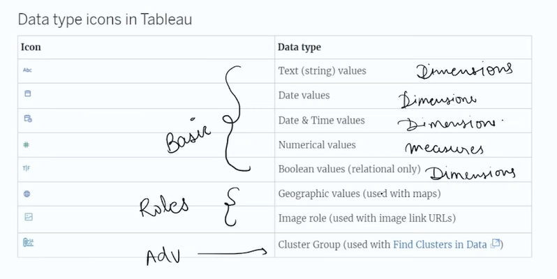
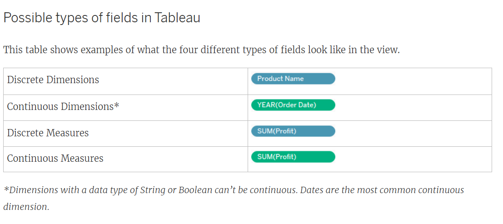
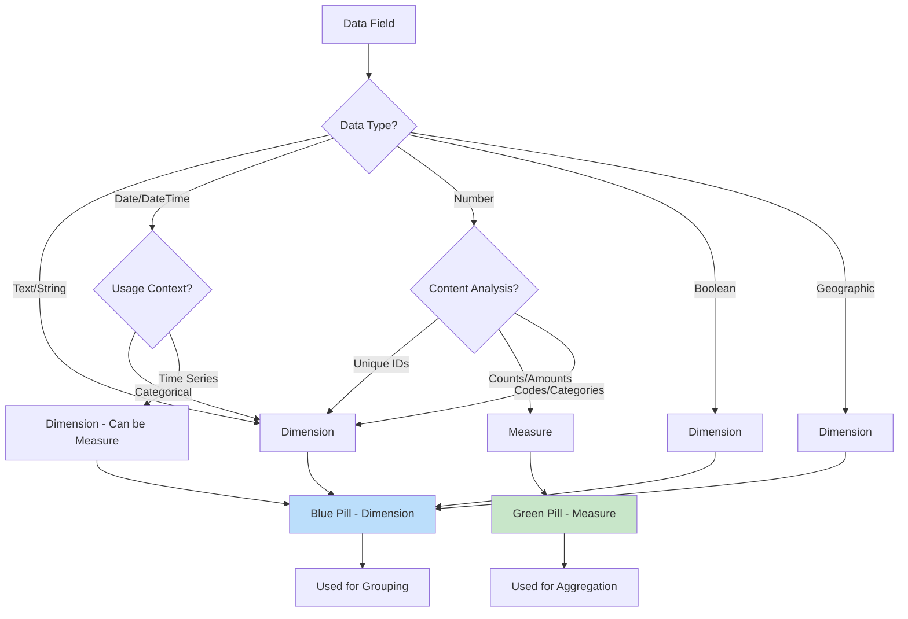
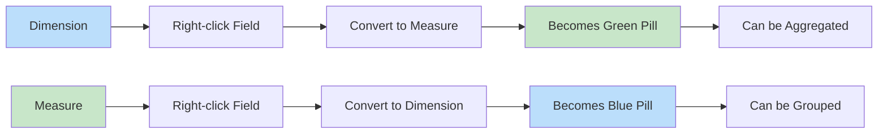
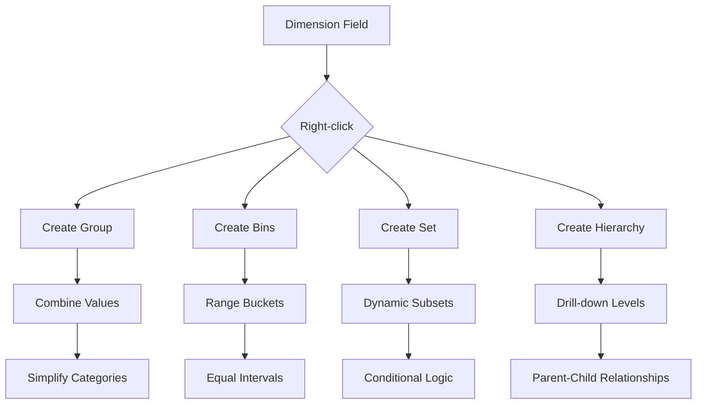

# 📏 Measures and Dimensions in Tableau

## Overview

In Tableau, data fields are automatically classified as either **Dimensions** or **Measures** based on their data type and content. This classification determines how fields behave in visualizations and calculations.



## Dimensions

### Definition
Dimensions are categorical fields that contain qualitative data. They are used to slice, dice, and group data in visualizations.

### Characteristics
- **Qualitative Data**: Text, dates, categories
- **Grouping Fields**: Used to create headers, labels, and categories
- **Discrete by Default**: Can be treated as continuous in some cases
- **Icon**: Blue pill (🔵) in Tableau

### Examples
- **Text Dimensions**: Customer Name, Product Category, Country
- **Date Dimensions**: Order Date, Ship Date, Birth Date
- **Numeric Dimensions**: Customer ID, Postal Code, Phone Number

### Common Operations
- **Grouping**: Combine similar values
- **Sorting**: Arrange data alphabetically or by frequency
- **Filtering**: Include/exclude specific values
- **Hierarchies**: Create drill-down paths

## Measures

### Definition
Measures are quantitative fields that contain numeric data. They are used for calculations, aggregations, and mathematical operations.

### Characteristics
- **Quantitative Data**: Numbers that can be measured and aggregated
- **Aggregation Fields**: Automatically aggregated (SUM, AVG, etc.)
- **Continuous by Default**: Represent magnitudes and amounts
- **Icon**: Green pill (🟢) in Tableau

### Examples
- **Sales Figures**: Revenue, Profit, Quantity Sold
- **Performance Metrics**: Conversion Rate, Customer Satisfaction Score
- **Time Measurements**: Duration, Age, Years of Service

### Common Operations
- **Aggregation**: SUM, AVG, MIN, MAX, COUNT
- **Mathematical Calculations**: Addition, subtraction, percentages
- **Statistical Analysis**: Standard deviation, variance
- **Trend Analysis**: Growth rates, moving averages

## Dimensions vs Measures Comparison

| Aspect | Dimensions | Measures |
|--------|------------|----------|
| **Data Type** | Qualitative | Quantitative |
| **Default Color** | Blue (🔵) | Green (🟢) |
| **Placement** | Rows/Columns (discrete) | Rows/Columns (continuous) |
| **Operations** | Group, Filter, Sort | Aggregate, Calculate |
| **Visualization** | Categories, Labels | Axes, Values |
| **Examples** | Customer Name, Date | Sales Amount, Profit |

## Field Classification Flowchart



## Tableau Field Roles

### Discrete vs Continuous
- **Discrete Fields**: Individual, distinct values (blue pills)
  - Dimensions are typically discrete
  - Used for categorical grouping
- **Continuous Fields**: Range of values (green pills)
  - Measures are typically continuous
  - Used for quantitative analysis

### Converting Between Roles



## Aggregation in Measures

### Default Aggregations
- **SUM**: Total of all values
- **AVG**: Average of all values
- **MIN**: Smallest value
- **MAX**: Largest value
- **COUNT**: Number of records
- **COUNTD**: Number of distinct values

### Custom Aggregations
```sql
-- Percentage of Total
SUM([Sales]) / TOTAL(SUM([Sales]))

-- Running Total
RUNNING_SUM(SUM([Sales]))

-- Difference from Previous
[Sales] - LOOKUP([Sales], -1)

-- Year-over-Year Growth
([Sales] - LOOKUP([Sales], -1)) / LOOKUP([Sales], -1)
```

## Dimension Operations

### Grouping and Binning


### Sets and Parameters
- **Sets**: Custom subsets of data for comparison
- **Parameters**: Dynamic values for interactivity
- **Groups**: Combine dimension members
- **Bins**: Group numeric dimensions into ranges

## Best Practices

### Dimension Best Practices
- **Limit Cardinality**: Avoid high-cardinality dimensions (>1000 unique values)
- **Use Hierarchies**: Create logical drill-down paths
- **Consistent Naming**: Use clear, descriptive names
- **Data Quality**: Clean and standardize dimension values

### Measure Best Practices
- **Choose Appropriate Aggregation**: Use meaningful aggregations
- **Handle Nulls**: Use ZN() or ISNULL() for missing values
- **Performance**: Avoid complex calculations on large datasets
- **Formatting**: Apply consistent number formatting

## Common Issues and Solutions

### 1. Wrong Field Classification
**Problem**: Tableau misclassifies dimensions as measures or vice versa
**Solution**: Manually convert field roles or change data types

### 2. High Cardinality Dimensions
**Problem**: Too many unique values slow down performance
**Solution**: Group values, create sets, or use filters

### 3. Measure Aggregation Issues
**Problem**: Incorrect aggregations in visualizations
**Solution**: Change default aggregation or use table calculations

### 4. Mixed Data Types
**Problem**: Fields contain both text and numbers
**Solution**: Split into separate fields or use calculated fields

## Advanced Concepts

### Table Calculations
- **Percent of Total**: Show contribution to whole
- **Running Totals**: Cumulative sums over time
- **Moving Averages**: Smooth out fluctuations
- **Rankings**: Order and compare values

### Level of Detail (LOD) Expressions
```sql
-- Fixed LOD
{FIXED [Category] : SUM([Sales])}

-- Include LOD
{INCLUDE [Sub-Category] : AVG([Profit])}

-- Exclude LOD
{EXCLUDE [Region] : MAX([Sales])}
```

### Calculated Fields
- **Basic Calculations**: Simple arithmetic
- **Conditional Logic**: IF/THEN statements
- **String Manipulations**: Text processing
- **Date Calculations**: Time-based operations

## Visualization Impact

| Field Type | Chart Types | Placement |
|------------|-------------|-----------|
| **Dimensions** | Bar charts, pie charts | Rows, Columns, Color, Size |
| **Measures** | Line charts, scatter plots | Rows, Columns, Color, Size |
| **Both** | Tables, heat maps | Any shelf |

## Performance Optimization

### For Dimensions
- **Extract Filters**: Reduce data volume
- **Context Filters**: Improve query performance
- **Data Source Filters**: Limit data at source

### For Measures
- **Extracts**: Pre-aggregate data
- **Live Connections**: Real-time data access
- **Incremental Refreshes**: Update only changed data

## Real-World Examples

### Retail Analytics
- **Dimensions**: Product Category, Customer Segment, Store Location
- **Measures**: Sales Revenue, Profit Margin, Units Sold

### Financial Reporting
- **Dimensions**: Account Type, Department, Time Period
- **Measures**: Budget Amount, Actual Spend, Variance

### Customer Analytics
- **Dimensions**: Customer Demographics, Purchase Channel, Geographic Region
- **Measures**: Customer Lifetime Value, Purchase Frequency, Satisfaction Score

🔗 [Tableau Dimensions and Measures Documentation](https://help.tableau.com/current/pro/desktop/en-us/datafields_typesandroles.htm)
🔗 [Calculated Fields Best Practices](https://help.tableau.com/current/pro/desktop/en-us/calculations_calculatedfields.htm)