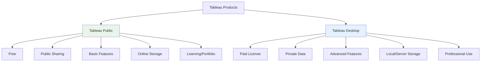
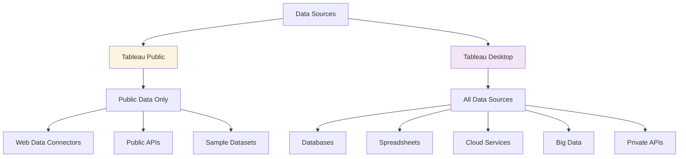
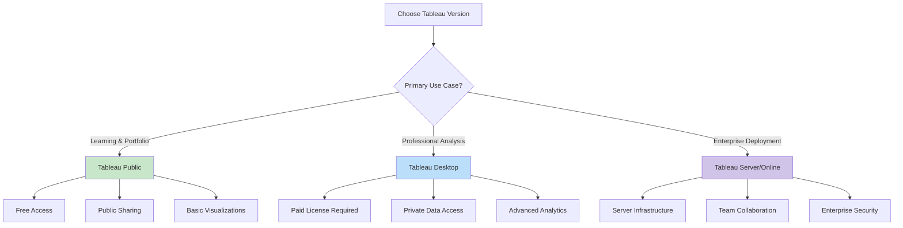

# 🆓 Tableau Public and Desktop

### Tableau Public
- Free version of Tableau.
- Allows creation and sharing of visualizations publicly on Tableau's server.
- Limited to public data sources; cannot connect to private databases or local files.
- Workbooks are saved online and accessible to anyone.
- Ideal for learning, sharing public data insights, and building a portfolio.

### Tableau Desktop
- Paid software with full functionality.
- Supports connections to a wide range of data sources, including private databases, spreadsheets, and cloud services.
- Workbooks can be saved locally or published to Tableau Server/Online.
- Includes advanced features like data blending, custom calculations, and integration with R/Python.
- Suitable for professional data analysis and enterprise use.

### Key Differences
| Aspect          | Tableau Public | Tableau Desktop |
|-----------------|----------------|-----------------|
| **Cost**        | Free          | Paid License   |
| **Data Privacy**| Public Sharing| Private Handling|
| **Features**    | Basic         | Advanced       |
| **Storage**     | Online Only   | Local/Server   |

## Feature Comparison Diagram

## Data Source Connectivity

## Use Case Flowchart

